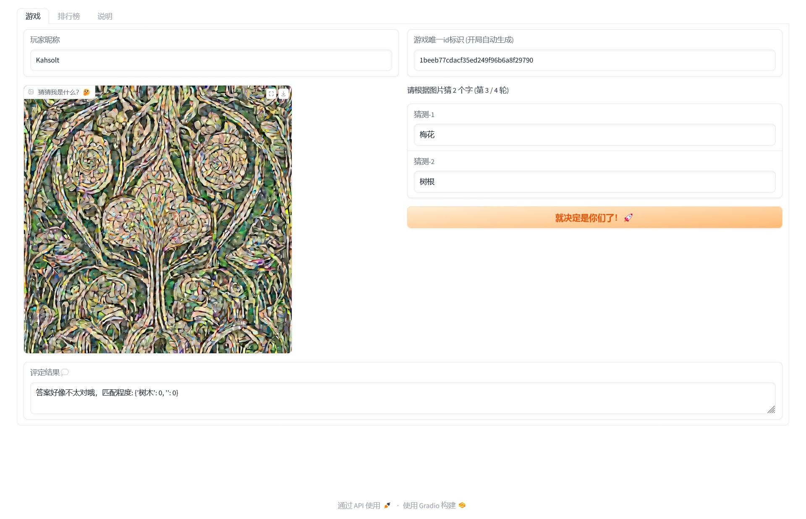

# Draw-Something-xspace

    The Draw Something game via stable diffusion ;)
    基于扩散模型的我画你猜小游戏

----

ℹ 本项目来源于 [昇思MindSpore 学习打卡营第三期](https://xihe.mindspore.cn/events/mindspore_clockin_3th) - 创意应用开发  
ℹ 应用已部署在 [modelers](https://modelers.cn/spaces) 平台，可直接访问体验空间 [https://modelers.cn/spaces/kahsolt/Draw-Something](https://modelers.cn/spaces/kahsolt/Draw-Something)  



```
[hardware]
CPU:    Kunpeng-920 (aarch64), 16 out of 192
NPU:    Ascend 910B2 (HBM 64G); CANN 8.0.RC2
Mem:    128G out of 1.5T
Disk:   512G
OS:     Linux version 4.19.90-2102.2.0.0068.3.ctl2.aarch64 (abuild@obs-arm-worker-01) (gcc version 7.3.0 (GCC)) #1 SMP Thu Jun 13 00:10:29 UTC 2024

[pip packages]
python             3.9.20
mindspore          2.3.1
mindformers        1.2.0
mindpet            1.0.4
openmind           0.8.0
openmind_datasets  0.7.0
openmind_evaluate  0.7.0
openmind-hub       0.8.0
gradio             4.44.0
numpy              1.26.4
```

#### references

- https://modelers.cn/spaces/PyTorch-NPU/SDXL_Lightning
- https://modelers.cn/spaces/PyTorch-NPU/stable-diffusion-xl-base-1
- https://modelers.cn/spaces/PyTorch-NPU/stable-diffusion-v1_5
- https://modelers.cn/spaces/MindSpore-Lab/SDXL-Base-1_0

----
by Armit
2024/10/10
